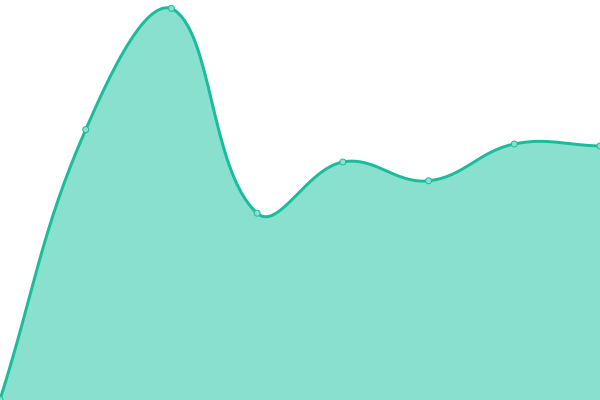
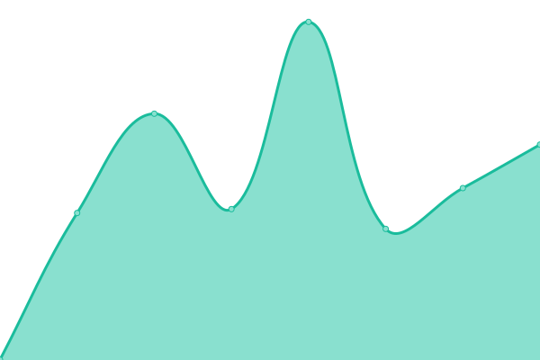

# [📈 Live Status](https://status.saltyspamz.xyz): <!--live status--> **🟩 All systems operational**

This repository contains the open-source uptime monitor and status page for [Salty-Coder](https://saltyspamz.xyz), powered by [Upptime](https://github.com/upptime/upptime).

With [Upptime](https://upptime.js.org), you can get your own unlimited and free uptime monitor and status page, powered entirely by a GitHub repository. We use [Issues](https://github.com/Salty-Coder/salty-site-status/issues) as incident reports, [Actions](https://github.com/Salty-Coder/salty-site-status/actions) as uptime monitors, and [Pages](https://status.saltyspamz.xyz) for the status page.

<!--start: status pages-->
<!-- This summary is generated by Upptime (https://github.com/upptime/upptime) -->
<!-- Do not edit this manually, your changes will be overwritten -->
<!-- prettier-ignore -->
| URL | Status | History | Response Time | Uptime |
| --- | ------ | ------- | ------------- | ------ |
|  [Salty Website](https://saltyspamz.xyz) | 🟩 Up | [salty-website.yml](https://github.com/Salty-Coder/salty-site-status/commits/HEAD/history/salty-website.yml) | 

 457ms
     
 | 

<a href="https://status.saltyspamz.xyz/history/salty-website">100.00%</a>
    

|  [Salty Suite Website](https://suite.saltyspamz.xyz) | 🟩 Up | [salty-suite-website.yml](https://github.com/Salty-Coder/salty-site-status/commits/HEAD/history/salty-suite-website.yml) | 

 476ms
     
 | 

<a href="https://status.saltyspamz.xyz/history/salty-suite-website">100.00%</a>
    

|  Salty Suite Account System | 🟩 Up | [salty-suite-account-system.yml](https://github.com/Salty-Coder/salty-site-status/commits/HEAD/history/salty-suite-account-system.yml) | 

 730ms
     
 | 

<a href="https://status.saltyspamz.xyz/history/salty-suite-account-system">100.00%</a>
    

|  Minecraft Classic Multiplayer Server | 🟩 Up | [minecraft-classic-multiplayer-server.yml](https://github.com/Salty-Coder/salty-site-status/commits/HEAD/history/minecraft-classic-multiplayer-server.yml) | 

 136ms
     
 | 

<a href="https://status.saltyspamz.xyz/history/minecraft-classic-multiplayer-server">100.00%</a>
    

<!--end: status pages-->

[**Visit our status website →**](https://status.saltyspamz.xyz)

## 📄 License

- Powered by: [Upptime](https://github.com/upptime/upptime)
- Code: [MIT](./LICENSE) © [Salty-Coder](https://saltyspamz.xyz)
- Data in the `./history` directory: [Open Database License](https://opendatacommons.org/licenses/odbl/1-0/)
